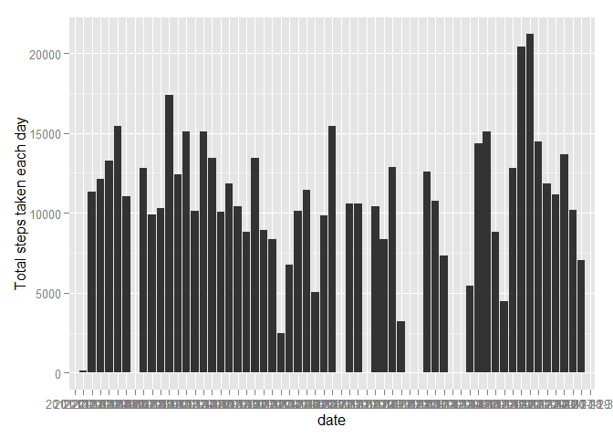

# Reproducible Research: Peer Assessment 1


## Loading and preprocessing the data

First, we download and unzip the data file from 

```r
# link <- "https://d396qusza40orc.cloudfront.net/repdata%2Fdata%2Factivity.zip"
# download.file(url = link, destfile='./activity.zip',method = destfile)
# dataFile <- read.csv(unz("./activity.zip", "./activity."))

unzip("./activity.zip")
activity <- read.csv("./activity.csv")
head(activity)
```

```
##   steps       date interval
## 1    NA 2012-10-01        0
## 2    NA 2012-10-01        5
## 3    NA 2012-10-01       10
## 4    NA 2012-10-01       15
## 5    NA 2012-10-01       20
## 6    NA 2012-10-01       25
```


```r
library(plyr)
```

```
## 
## Attaching package: 'plyr'
## 
## The following object is masked from 'package:lubridate':
## 
##     here
```

```r
library(ggplot2)
library(scales)
#Summarize measurements grouped by date
matrix <- ddply(activity, c("date"), summarise, total_steps = sum(steps))
matrix$date <- as.Date(matrix$date)

ggplot(data = matrix, aes(x = date, y = total_steps)) +
      geom_histogram(stat = "identity") +
      ggtitle("Total number of steps grouped by day") +
      scale_y_continuous("Total number of steps") +
      scale_x_date("Day", labels=date_format("%b %d, %Y"), breaks = date_breaks("2 day")) +
      theme(axis.text.x=element_text(angle=90,hjust=1,vjust=0.5), 
            text = element_text(size=10))
```

```
## Warning: Removed 8 rows containing missing values (position_stack).
```

 
We convert date varaible using

Now convert object from data frame to data table

## What is mean total number of steps taken per day?


## What is the average daily activity pattern?


## Imputing missing values


## Are there differences in activity patterns between weekdays and weekends?
