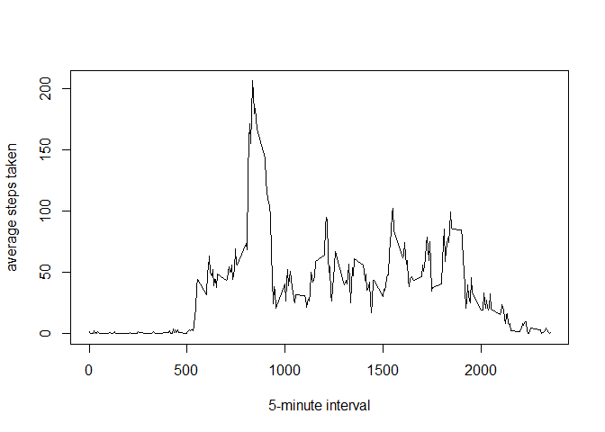
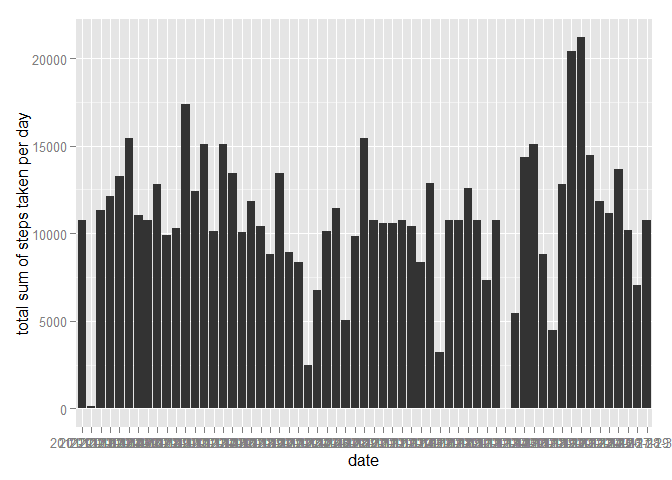
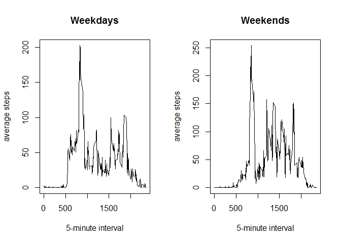

# Reproducible Research: Peer Assessment 1


## Loading and preprocessing the data 

1.Read in the unzipped .csv data file

```r
activity <- read.csv('./activity.csv')
```

2.Convert object from data frame to data table

```r
library(data.table)
activity <- data.table(activity)
```

## What is mean total number of steps taken per day?

1.Make a histogram of the total steps for each day

```r
sumSteps <- activity[, sum(steps, na.rm=T), by=date]
library(ggplot2)
plot1 <- ggplot(sumSteps, aes(date, V1)) + geom_histogram(stat='identity') + ylab('Total steps taken each day')
print(plot1)
```

 

2.Calculate the mean and median of total steps each day

```r
meanSteps <- activity[, mean(steps, na.rm=T), by=date]
setnames(meanSteps, old =c('date', 'V1'), new = c('date', 'mean'))
medianSteps <- activity[, median(as.double(steps, na.rm=T)), by=date]
setnames(medianSteps, old =c('date', 'V1'), new = c('date', 'median'))
meanMedianSteps <- merge(meanSteps, medianSteps, by='date')
```


```r
# mean(matrix$total_steps, na.rm = TRUE)
```

The mean of the total number of steps per day is shown in the following table:

```r
head(meanMedianSteps)
```

```
##          date     mean median
## 1: 2012-10-01      NaN     NA
## 2: 2012-10-02  0.43750      0
## 3: 2012-10-03 39.41667      0
## 4: 2012-10-04 42.06944      0
## 5: 2012-10-05 46.15972      0
## 6: 2012-10-06 53.54167      0
```


## What is the average daily activity pattern?

1.The average daily activity pattern

```r
avgSteps <- activity[, mean(steps,na.rm=T), by=interval]
plot(avgSteps,type="l", xlab="5-minute interval", ylab="average steps taken")
```

 

The 5-minute interval which contains the maximum number of steps is 

```r
maxSteps <- which.max(avgSteps$V1)
maxInterval <- avgSteps$interval[maxSteps]
maxInterval
```

```
## [1] 835
```


## Imputing missing values

1.Calculate the total number of missing values in the dataset 

```r
count <- sum(is.na(activity$steps))
count
```

```
## [1] 2304
```


2.Create new dataset from activity with the missing data filled in.

```r
newActivity <- activity;
for (i in 1:nrow(newActivity)) {
        if (is.na(activity$steps)[i]==T) {
                maxStep2 <- which(avgSteps$interval==newActivity$interval[i]);
                newActivity$steps[i] <- avgSteps$V1[maxStep2]
        }
}
```

3.Make a histogram of steps taken each day of the new dataset

```r
sumSteps2 <- newActivity[, sum(steps), by=date]
plot2 <- ggplot(sumSteps2, aes(date,V1)) + geom_histogram(stat="identity") + 
        ylab("total sum of steps taken per day")
print(plot2)
```

 

4.Report the mean and median total number of steps taken per day of the new dataset

```r
meanSteps2 <- newActivity[, mean(steps), by=date]
medianSteps2 <- newActivity[, median(as.double(steps)) ,by=date]
meanMedianSteps2 <- merge(meanSteps2, medianSteps2, by='date')
head(meanMedianSteps2)
```

```
##          date     V1.x     V1.y
## 1: 2012-10-01 37.38260 34.11321
## 2: 2012-10-02  0.43750  0.00000
## 3: 2012-10-03 39.41667  0.00000
## 4: 2012-10-04 42.06944  0.00000
## 5: 2012-10-05 46.15972  0.00000
## 6: 2012-10-06 53.54167  0.00000
```

as we can see, the missing values have all been replaced by the average for
5-interval minutes.

## Are there differences in activity patterns between weekdays and weekends?

1.Create a new factor variable in the dataset with two levels weekday and weekend indicating whether a given date is a weekday or weekend day.

```r
library(lubridate)
```

```
## 
## Attaching package: 'lubridate'
## 
## The following objects are masked from 'package:data.table':
## 
##     hour, mday, month, quarter, wday, week, yday, year
```

```r
newActivity$weekdays <- wday(as.Date(newActivity$date))
Indweekday <- which(newActivity$weekdays!=6 & newActivity$weekdays!=7)
newActWeekday <- newActivity[Indweekday,]
Indweekend <- which(newActivity$weekdays==6 | newActivity$weekdays==7)
newActWeekend <- newActivity[Indweekend,]
```

2.Make a panel plot containing a time series (i.e. type = "l") of the 5-minute interval (x-axis) and the average number of steps taken, averaged across all weekday days or weekend days (y-axis). 

```r
par(mfrow=c(1,2))
avgStepsWeekday <- newActWeekday[, mean(steps), by=interval]
plot(avgStepsWeekday, type="l", xlab="5-minute interval",
     ylab="average steps",main="Weekdays")

avgStepsWeekend <- newActWeekend[, mean(steps), by=interval]
plot(avgStepsWeekend, type="l", xlab="5-minute interval", 
     ylab="average steps",main="Weekends")
```

 


## Conclusions

Comparing the number of steps taken over weekdays and weekends, we can visually infer more intervals with average steps greater than 100 over weekends. We can conclude that on average, users of activity monitoring devices walk more on weekends.
